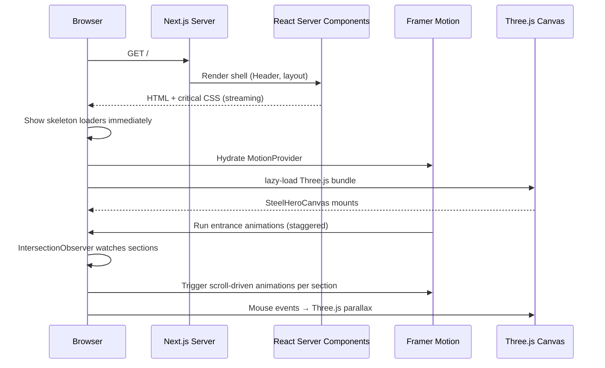

# Design Document: Website Performance & UI Enhancements
## Shree Balaji Rolling Mills — Next.js 16 + Framer Motion + Three.js

---

## Overview

This document covers the complete technical design for optimizing the Shree Balaji Rolling Mills website across three pillars: **build/bundle performance** (Turbopack + Next.js config), **skeleton loading system** (perceived performance), and **dynamic interactive UI** (scroll animations, mouse parallax, counters, page transitions, and Canvas/Three.js interactivity). The site runs on Next.js 16.3.0 with React 19, Framer Motion 13, Three.js, and Tailwind CSS v4.

The existing codebase already contains three Three.js canvas components (`SteelHeroCanvas`, `SteelProductViewer`, `SteelSparksCanvas`) with manual mouse-tracking patterns, CSS-based glass morphism animations, and a rich design token system. All enhancements must integrate cleanly with these existing patterns.

---

## Architecture

```mermaid
graph TD
    A[Next.js 16 App Router] --> B[Turbopack Dev Server]
    A --> C[Optimized next.config.ts]
    C --> D[Bundle Splitting Strategy]
    C --> E[Image Optimization Pipeline]
    C --> F[Compiler Transforms]

    G[Animation System] --> H[MotionProvider — Framer Motion context]
    G --> I[useScrollAnimation hook]
    G --> J[useMouseParallax hook]
    G --> K[useReducedMotion hook]

    L[Skeleton System] --> M[SkeletonBase component]
    L --> N[Section-specific skeletons]
    L --> O[Suspense boundaries]

    P[Interaction Layer] --> Q[useKeyboardNav hook]
    P --> R[MouseTracker context]
    P --> S[ScrollProgress provider]

    T[Three.js Layer] --> U[SteelHeroCanvas — enhanced mouse]
    T --> V[SteelSparksCanvas — scroll-driven]
    T --> W[SteelProductViewer — interaction]
```



---

## Components and Interfaces

See Section 1.3 below for the full component interface catalog (`MotionProvider`, `SkeletonBase`, `ScrollAnimationWrapper`, `MouseTracker`, `PageTransition`, and all animation hooks).

## Data Models

See Section 1.4 below for the `AnimationVariant` type, `ANIMATION_VARIANTS` catalog, and `PerformanceBudget` definitions.

## Error Handling

See Section 1.5 below for Three.js WebGL fallback boundaries, Framer Motion animation failure recovery, and reduced-motion gating strategy.

---

## Part 1: High-Level Design

### 1.1 System Sequence: Page Load & Animation Lifecycle



### 1.2 Performance Architecture

The performance strategy layers three complementary approaches:

**Build-time**: Turbopack replaces webpack for dev, enabling sub-300ms HMR. Production builds use Next.js's built-in SWC compiler with manual chunk splitting to keep the initial JS bundle below 150 KB gzipped.

**Runtime**: React Suspense boundaries gate heavy components (Three.js canvases, inquiry form, growth timeline). Each boundary shows a skeleton while the chunk loads. `useReducedMotion` disables all non-essential animations for users with `prefers-reduced-motion`.

**Perceived performance**: Skeleton loaders match the exact dimensions of real content, eliminating cumulative layout shift (CLS < 0.1). Animations use `transform` and `opacity` exclusively — never `width`, `height`, or `top`/`left` — keeping all animation work on the compositor thread.

### 1.3 Components and Interfaces

#### MotionProvider

**Purpose**: Global Framer Motion configuration and reduced-motion detection

```typescript
interface MotionProviderProps {
  children: React.ReactNode
}

// Provides: prefersReducedMotion boolean via context
// Exports: useMotionConfig() hook
```

#### SkeletonBase

**Purpose**: Reusable shimmer skeleton primitive

```typescript
interface SkeletonBaseProps {
  className?: string
  variant?: 'text' | 'rect' | 'circle'
  width?: string | number
  height?: string | number
  animate?: boolean  // false when prefers-reduced-motion
}
```

#### ScrollAnimationWrapper

**Purpose**: Wraps any section to trigger Framer Motion entrance on scroll

```typescript
interface ScrollAnimationWrapperProps {
  children: React.ReactNode
  variant?: 'fadeUp' | 'fadeIn' | 'slideLeft' | 'slideRight' | 'scaleIn'
  delay?: number      // seconds, default 0
  threshold?: number  // IntersectionObserver threshold, default 0.15
  once?: boolean      // animate only first time in view, default true
}
```

#### MouseTracker (Context)

**Purpose**: Centralizes mouse position tracking to avoid per-component event listeners

```typescript
interface MousePosition {
  x: number   // -1 to 1 normalized
  y: number   // -1 to 1 normalized
  rawX: number
  rawY: number
}

// Context provides: MousePosition
// Updates at most 60fps via requestAnimationFrame
```

#### PageTransition

**Purpose**: Smooth route-change animations using Framer Motion AnimatePresence

```typescript
interface PageTransitionProps {
  children: React.ReactNode
  // Wraps layout.tsx — triggers on pathname change
}
```

### 1.4 Data Models

#### Animation Variant Catalog

```typescript
type AnimationVariant = {
  hidden: MotionProps['initial']
  visible: MotionProps['animate']
  exit?: MotionProps['exit']
  transition: Transition
}

const ANIMATION_VARIANTS: Record<string, AnimationVariant> = {
  fadeUp: {
    hidden: { opacity: 0, y: 32 },
    visible: { opacity: 1, y: 0 },
    transition: { duration: 0.55, ease: [0.16, 1, 0.3, 1] }
  },
  fadeIn: {
    hidden: { opacity: 0 },
    visible: { opacity: 1 },
    transition: { duration: 0.45, ease: 'easeOut' }
  },
  slideLeft: {
    hidden: { opacity: 0, x: -40 },
    visible: { opacity: 1, x: 0 },
    transition: { duration: 0.5, ease: [0.16, 1, 0.3, 1] }
  },
  slideRight: {
    hidden: { opacity: 0, x: 40 },
    visible: { opacity: 1, x: 0 },
    transition: { duration: 0.5, ease: [0.16, 1, 0.3, 1] }
  },
  scaleIn: {
    hidden: { opacity: 0, scale: 0.92 },
    visible: { opacity: 1, scale: 1 },
    transition: { duration: 0.5, ease: [0.16, 1, 0.3, 1] }
  }
}
```

#### Performance Budget

```typescript
type PerformanceBudget = {
  metric: string
  target: string
  threshold: string   // fail CI if exceeded
  tool: string
}

const PERFORMANCE_BUDGETS: PerformanceBudget[] = [
  { metric: 'LCP',              target: '< 2.5s',   threshold: '3.0s',   tool: 'Lighthouse' },
  { metric: 'FCP',              target: '< 1.5s',   threshold: '2.0s',   tool: 'Lighthouse' },
  { metric: 'CLS',              target: '< 0.05',   threshold: '0.1',    tool: 'Web Vitals' },
  { metric: 'TTI',              target: '< 3.5s',   threshold: '4.0s',   tool: 'Lighthouse' },
  { metric: 'Total JS (gzip)',  target: '< 150 KB', threshold: '200 KB', tool: 'Bundle Analyzer' },
  { metric: 'Three.js chunk',   target: '< 90 KB',  threshold: '120 KB', tool: 'Bundle Analyzer' },
  { metric: 'Framer chunk',     target: '< 30 KB',  threshold: '50 KB',  tool: 'Bundle Analyzer' },
  { metric: 'Lighthouse score', target: '≥ 90',     threshold: '85',     tool: 'Lighthouse CI' }
]
```

### 1.5 Error Handling

**Three.js canvas failures**: Each canvas component wraps in a React error boundary. If WebGL is unavailable (old devices, certain browsers), the boundary renders a static gradient background matching the canvas colors — no broken UI.

**Animation failures**: Framer Motion variants are wrapped in try-catch at the `AnimatePresence` level. If a variant throws, the component renders without animation via `initial={false}`.

**Reduced motion**: All animation code gates behind `prefersReducedMotion` — skeletons still animate with a static fill (no shimmer), page transitions use instant opacity instead of slides.

### 1.6 Security Considerations

- No new network requests are introduced by the animation system
- Mouse position data never leaves the client
- `dynamic()` imports do not expose any sensitive code paths
- CSP headers must allow `blob:` and `data:` for Three.js shader compilation (already implied by existing Three.js usage)

---

## Part 2: Low-Level Design

### 2.1 Turbopack + Next.js Configuration

The current `next.config.ts` is empty. The complete optimized configuration:

```typescript
// next.config.ts
import type { NextConfig } from 'next'
import type { WebpackConfigContext } from 'next/dist/server/config-shared'

const nextConfig: NextConfig = {
  // ─── Turbopack (dev only — production still uses SWC/webpack) ───
  turbopack: {
    // Resolve aliases matching tsconfig paths
    resolveAlias: {
      '@': './src',
    },
  },

  // ─── SWC Compiler transforms ───────────────────────────────────
  compiler: {
    // Remove console.log in production (keep console.error/warn)
    removeConsole: process.env.NODE_ENV === 'production'
      ? { exclude: ['error', 'warn'] }
      : false,
  },

  // ─── Image optimization ────────────────────────────────────────
  images: {
    formats: ['image/avif', 'image/webp'],
    deviceSizes: [640, 750, 828, 1080, 1200, 1920],
    imageSizes: [16, 32, 48, 64, 96, 128, 256],
    minimumCacheTTL: 60 * 60 * 24 * 30, // 30 days
    dangerouslyAllowSVG: false,
    contentSecurityPolicy: "default-src 'self'; script-src 'none'; sandbox;",
  },

  // ─── Headers for performance ───────────────────────────────────
  async headers() {
    return [
      {
        source: '/:all*(svg|jpg|jpeg|png|webp|avif|gif|ico)',
        locale: false,
        headers: [
          { key: 'Cache-Control', value: 'public, max-age=31536000, immutable' },
        ],
      },
      {
        source: '/_next/static/:path*',
        headers: [
          { key: 'Cache-Control', value: 'public, max-age=31536000, immutable' },
        ],
      },
    ]
  },

  // ─── Bundle splitting (webpack — production builds) ────────────
  webpack(config, { isServer, dev }: WebpackConfigContext) {
    if (!dev && !isServer) {
      config.optimization = {
        ...config.optimization,
        splitChunks: {
          chunks: 'all',
          cacheGroups: {
            // Isolate Three.js into its own chunk (~580 KB raw → ~90 KB gzip)
            three: {
              test: /[\\/]node_modules[\\/](three|@types\/three)[\\/]/,
              name: 'vendor-three',
              chunks: 'async',
              priority: 30,
            },
            // Isolate Framer Motion into its own chunk
            framer: {
              test: /[\\/]node_modules[\\/]framer-motion[\\/]/,
              name: 'vendor-framer',
              chunks: 'async',
              priority: 25,
            },
            // All other node_modules
            vendors: {
              test: /[\\/]node_modules[\\/]/,
              name: 'vendors',
              chunks: 'all',
              priority: 10,
            },
          },
        },
      }
    }
    return config
  },

  // ─── Experimental features ─────────────────────────────────────
  experimental: {
    // Optimise CSS delivery (inline critical CSS)
    optimizeCss: true,
    // Faster module resolution
    optimizePackageImports: [
      'lucide-react',
      'framer-motion',
    ],
  },
}

export default nextConfig
```

**Key decisions**:
- `turbopack` block only affects `next dev` — production build is unchanged
- `vendor-three` uses `chunks: 'async'` so Three.js never blocks initial render
- `optimizePackageImports` eliminates the barrel-import penalty for lucide-react (currently imports every icon)
- `optimizeCss: true` inlines critical above-fold CSS, removing a render-blocking stylesheet request

### 2.2 Dynamic Imports — Component Loading Strategy

All Three.js canvas components and the heavy data-visualization components must be dynamically imported. This keeps the initial bundle small and lets the browser prioritize LCP content.

```typescript
// src/app/page.tsx — updated imports
import dynamic from 'next/dynamic'

// Three.js canvases — SSR disabled, no loading spinner (skeleton handles it)
const SteelHeroCanvas = dynamic(
  () => import('@/components/3d/SteelHeroCanvas').then(m => ({ default: m.SteelHeroCanvas })),
  { ssr: false }
)

const SteelSparksCanvas = dynamic(
  () => import('@/components/3d/SteelSparksCanvas').then(m => ({ default: m.SteelSparksCanvas })),
  { ssr: false }
)

const SteelProductViewer = dynamic(
  () => import('@/components/3d/SteelProductViewer').then(m => ({ default: m.SteelProductViewer })),
  { ssr: false }
)

// Heavy sections — SSR ok, but code-split
const GrowthTimeline = dynamic(
  () => import('@/components/timeline/GrowthTimeline').then(m => ({ default: m.GrowthTimeline }))
)

const InquiryForm = dynamic(
  () => import('@/components/inquiry-form/InquiryForm').then(m => ({ default: m.InquiryForm }))
)
```

**Loading sequence priority** (based on viewport order):
1. `Header` + `HeroSection` shell — SSR, no dynamic import
2. `SteelHeroCanvas` — async, loads in parallel with hero content paint
3. `ProductHub` shell — SSR
4. `SteelProductViewer` — loads only when user clicks "Show 3D View"
5. `GrowthTimeline`, `InquiryForm`, `TrustSection`, `ContactSection`, `Footer` — lazy, load as user scrolls

### 2.3 Skeleton Loader System

#### SkeletonBase Component

```typescript
// src/components/ui/skeleton/SkeletonBase.tsx
'use client'

import { cn } from '@/lib/utils'

interface SkeletonBaseProps {
  className?: string
  variant?: 'text' | 'rect' | 'circle'
  animate?: boolean
}

export function SkeletonBase({ className, variant = 'rect', animate = true }: SkeletonBaseProps) {
  return (
    <div
      role="status"
      aria-label="Loading..."
      className={cn(
        'bg-steel-200',
        // Shimmer animation — uses CSS custom property for width
        animate && 'skeleton-shimmer',
        variant === 'circle' && 'rounded-full',
        variant === 'text' && 'rounded h-4',
        variant === 'rect' && 'rounded-2xl',
        className
      )}
    />
  )
}
```

```css
/* Add to globals.css */
@keyframes shimmer {
  0%   { background-position: -200% 0; }
  100% { background-position: 200% 0; }
}

.skeleton-shimmer {
  background: linear-gradient(
    90deg,
    var(--color-steel-200) 25%,
    var(--color-steel-100) 50%,
    var(--color-steel-200) 75%
  );
  background-size: 200% 100%;
  animation: shimmer 1.6s ease-in-out infinite;
}

@media (prefers-reduced-motion: reduce) {
  .skeleton-shimmer {
    animation: none;
    background: var(--color-steel-200);
  }
}
```

#### Section-Specific Skeletons

Each skeleton exactly mirrors the real component's layout to prevent CLS:

```typescript
// src/components/ui/skeleton/HeroSectionSkeleton.tsx
export function HeroSectionSkeleton() {
  return (
    <section className="relative pt-36 pb-24 md:pt-44 md:pb-32 section-hero border-b border-steel-200">
      <div className="max-w-7xl mx-auto px-4 sm:px-6 lg:px-8">
        {/* Badge */}
        <div className="flex justify-center mb-8">
          <SkeletonBase className="h-8 w-72 rounded-full" />
        </div>
        {/* H1 */}
        <div className="text-center max-w-4xl mx-auto space-y-4">
          <SkeletonBase className="h-16 w-full max-w-2xl mx-auto" />
          <SkeletonBase className="h-8 w-3/4 mx-auto" />
          <SkeletonBase className="h-5 w-1/2 mx-auto" />
        </div>
        {/* 4 CTA cards */}
        <div className="mt-12 grid grid-cols-1 sm:grid-cols-2 lg:grid-cols-4 gap-4">
          {[...Array(4)].map((_, i) => (
            <SkeletonBase key={i} className="h-48 rounded-3xl" />
          ))}
        </div>
        {/* Metric banner */}
        <SkeletonBase className="mt-16 h-28 w-full rounded-3xl" />
      </div>
    </section>
  )
}
```

```typescript
// src/components/ui/skeleton/ProductHubSkeleton.tsx
export function ProductHubSkeleton() {
  return (
    <section className="py-28 bg-steel-base border-b border-steel-200">
      <div className="max-w-7xl mx-auto px-4 sm:px-6 lg:px-8">
        <div className="text-center space-y-4 mb-16">
          <SkeletonBase className="h-6 w-40 rounded-full mx-auto" />
          <SkeletonBase className="h-12 w-2/3 mx-auto" />
          <SkeletonBase className="h-5 w-1/2 mx-auto" />
        </div>
        <div className="grid grid-cols-1 lg:grid-cols-2 gap-8">
          {[...Array(2)].map((_, i) => (
            <SkeletonBase key={i} className="h-[560px] rounded-3xl" />
          ))}
        </div>
      </div>
    </section>
  )
}
```

Additional skeletons follow the same pattern for: `GrowthTimelineSkeleton`, `InquiryFormSkeleton`, `TrustSectionSkeleton`, `ContactSectionSkeleton`, `FooterSkeleton`.

### 2.4 Animation System Architecture

#### Core Hooks

**`useScrollAnimation`** — triggers entrance animations when element enters viewport

```typescript
// src/hooks/useScrollAnimation.ts
'use client'

import { useRef } from 'react'
import { useInView } from 'framer-motion'

interface UseScrollAnimationOptions {
  threshold?: number   // 0 to 1, default 0.15
  once?: boolean       // default true
  margin?: string      // rootMargin, default '-50px'
}

export function useScrollAnimation(options: UseScrollAnimationOptions = {}) {
  const { threshold = 0.15, once = true, margin = '-50px' } = options
  const ref = useRef<HTMLElement>(null)
  const isInView = useInView(ref, {
    amount: threshold,
    once,
    margin,
  })
  return { ref, isInView }
}
```

**`useMouseParallax`** — smooth normalized mouse position for parallax effects

```typescript
// src/hooks/useMouseParallax.ts
'use client'

import { useEffect, useRef, useState } from 'react'

interface MouseParallaxState {
  x: number  // -1 to 1
  y: number  // -1 to 1
}

export function useMouseParallax(strength: number = 1): MouseParallaxState {
  const [position, setPosition] = useState<MouseParallaxState>({ x: 0, y: 0 })
  const targetRef = useRef<MouseParallaxState>({ x: 0, y: 0 })
  const rafRef = useRef<number>(0)
  const isReducedMotion = useReducedMotion()

  useEffect(() => {
    if (isReducedMotion) return

    const handleMouseMove = (e: MouseEvent) => {
      targetRef.current = {
        x: ((e.clientX / window.innerWidth) - 0.5) * 2 * strength,
        y: ((e.clientY / window.innerHeight) - 0.5) * 2 * strength,
      }
    }

    // Lerp toward target at 60fps
    const tick = () => {
      setPosition(prev => ({
        x: prev.x + (targetRef.current.x - prev.x) * 0.06,
        y: prev.y + (targetRef.current.y - prev.y) * 0.06,
      }))
      rafRef.current = requestAnimationFrame(tick)
    }

    window.addEventListener('mousemove', handleMouseMove, { passive: true })
    rafRef.current = requestAnimationFrame(tick)

    return () => {
      window.removeEventListener('mousemove', handleMouseMove)
      cancelAnimationFrame(rafRef.current)
    }
  }, [strength, isReducedMotion])

  return position
}
```

**`useAnimatedCounter`** — rolling number counter with easing

```typescript
// src/hooks/useAnimatedCounter.ts
'use client'

import { useEffect, useState, useRef } from 'react'
import { animate } from 'framer-motion'

interface UseAnimatedCounterOptions {
  from?: number        // default 0
  to: number
  duration?: number    // seconds, default 2.0
  decimals?: number    // default 0
  easing?: string      // framer-motion easing name, default 'easeOut'
  format?: (value: number) => string
  startOnMount?: boolean  // default false — start when trigger() called
}

export function useAnimatedCounter(options: UseAnimatedCounterOptions) {
  const {
    from = 0, to, duration = 2.0, decimals = 0,
    easing = 'easeOut', format, startOnMount = false
  } = options
  const [value, setValue] = useState(from)
  const controlsRef = useRef<ReturnType<typeof animate> | null>(null)
  const isReducedMotion = useReducedMotion()

  const start = () => {
    if (isReducedMotion) {
      setValue(to)
      return
    }
    if (controlsRef.current) controlsRef.current.stop()
    controlsRef.current = animate(from, to, {
      duration,
      ease: easing,
      onUpdate: (latest) => setValue(
        parseFloat(latest.toFixed(decimals))
      ),
    })
  }

  useEffect(() => {
    if (startOnMount) start()
    return () => controlsRef.current?.stop()
  }, [])  // eslint-disable-line react-hooks/exhaustive-deps

  const display = format ? format(value) : value.toLocaleString('en-IN')
  return { value, display, start }
}
```

**`useReducedMotion`** — convenience hook (re-exported from Framer Motion)

```typescript
// src/hooks/useReducedMotion.ts
export { useReducedMotion } from 'framer-motion'
```

**`useKeyboardNav`** — keyboard navigation support for interactive sections

```typescript
// src/hooks/useKeyboardNav.ts
'use client'

import { useCallback } from 'react'

type KeyboardNavOptions = {
  onEnter?: () => void
  onEscape?: () => void
  onArrowUp?: () => void
  onArrowDown?: () => void
  onArrowLeft?: () => void
  onArrowRight?: () => void
}

export function useKeyboardNav(options: KeyboardNavOptions) {
  return useCallback((e: React.KeyboardEvent) => {
    const handlers: Record<string, (() => void) | undefined> = {
      Enter: options.onEnter,
      Escape: options.onEscape,
      ArrowUp: options.onArrowUp,
      ArrowDown: options.onArrowDown,
      ArrowLeft: options.onArrowLeft,
      ArrowRight: options.onArrowRight,
    }
    const handler = handlers[e.key]
    if (handler) {
      e.preventDefault()
      handler()
    }
  }, [options])  // eslint-disable-line react-hooks/exhaustive-deps
}
```

### 2.5 ScrollAnimationWrapper Component

The primary building block for all scroll-triggered entrance animations. Wraps any section or element.

```typescript
// src/components/ui/animation/ScrollAnimationWrapper.tsx
'use client'

import { motion, Variants } from 'framer-motion'
import { useScrollAnimation } from '@/hooks/useScrollAnimation'
import { useReducedMotion } from 'framer-motion'
import { ANIMATION_VARIANTS } from '@/lib/animation-variants'

interface ScrollAnimationWrapperProps {
  children: React.ReactNode
  variant?: keyof typeof ANIMATION_VARIANTS
  delay?: number
  threshold?: number
  once?: boolean
  className?: string
  as?: keyof JSX.IntrinsicElements
}

export function ScrollAnimationWrapper({
  children,
  variant = 'fadeUp',
  delay = 0,
  threshold = 0.15,
  once = true,
  className,
  as: Tag = 'div',
}: ScrollAnimationWrapperProps) {
  const { ref, isInView } = useScrollAnimation({ threshold, once })
  const prefersReducedMotion = useReducedMotion()
  const selectedVariant = ANIMATION_VARIANTS[variant]

  // Precondition: variant must exist in catalog
  if (!selectedVariant) {
    console.warn(`[ScrollAnimationWrapper] Unknown variant: ${variant}`)
    return <Tag className={className}>{children}</Tag>
  }

  return (
    <motion.div
      ref={ref as React.Ref<HTMLDivElement>}
      className={className}
      initial={prefersReducedMotion ? false : selectedVariant.hidden}
      animate={isInView || prefersReducedMotion ? selectedVariant.visible : selectedVariant.hidden}
      transition={{
        ...selectedVariant.transition,
        delay: prefersReducedMotion ? 0 : delay,
      }}
    >
      {children}
    </motion.div>
  )
}
```

**Stagger container** — coordinates child entrance timing:

```typescript
// src/components/ui/animation/StaggerContainer.tsx
'use client'

import { motion } from 'framer-motion'

const staggerVariants = {
  hidden: { opacity: 0 },
  visible: {
    opacity: 1,
    transition: {
      staggerChildren: 0.08,   // 80ms between each child
      delayChildren: 0.1,
    },
  },
}

const staggerItemVariants = {
  hidden: { opacity: 0, y: 24 },
  visible: {
    opacity: 1, y: 0,
    transition: { duration: 0.5, ease: [0.16, 1, 0.3, 1] },
  },
}

export function StaggerContainer({ children, className }: { children: React.ReactNode; className?: string }) {
  return (
    <motion.div className={className} variants={staggerVariants} initial="hidden" whileInView="visible" viewport={{ once: true, amount: 0.1 }}>
      {children}
    </motion.div>
  )
}

export function StaggerItem({ children, className }: { children: React.ReactNode; className?: string }) {
  return (
    <motion.div className={className} variants={staggerItemVariants}>
      {children}
    </motion.div>
  )
}
```

### 2.6 Page Transition System

Route changes animate with a shared layout transition. Implemented in `layout.tsx`:

```typescript
// src/components/ui/animation/PageTransition.tsx
'use client'

import { motion, AnimatePresence } from 'framer-motion'
import { usePathname } from 'next/navigation'

const pageVariants = {
  initial: { opacity: 0, y: 12 },
  enter:   { opacity: 1, y: 0,  transition: { duration: 0.35, ease: [0.16, 1, 0.3, 1] } },
  exit:    { opacity: 0, y: -8, transition: { duration: 0.25, ease: 'easeIn' } },
}

export function PageTransition({ children }: { children: React.ReactNode }) {
  const pathname = usePathname()

  return (
    <AnimatePresence mode="wait" initial={false}>
      <motion.div
        key={pathname}
        variants={pageVariants}
        initial="initial"
        animate="enter"
        exit="exit"
      >
        {children}
      </motion.div>
    </AnimatePresence>
  )
}
```

Usage in `src/app/layout.tsx`:
```typescript
// Wrap {children} with PageTransition inside the body
<PageTransition>
  {children}
</PageTransition>
```

### 2.7 Component-Level Animation Specifications

#### HeroSection.tsx — Enhanced

**Entrance sequence** (staggered, runs once on first load):

```typescript
// Wrap the hero title
<motion.h1
  initial={{ opacity: 0, y: 40 }}
  animate={{ opacity: 1, y: 0 }}
  transition={{ duration: 0.7, ease: [0.16, 1, 0.3, 1], delay: 0.1 }}
>

// Subheading
<motion.p
  initial={{ opacity: 0, y: 24 }}
  animate={{ opacity: 1, y: 0 }}
  transition={{ duration: 0.6, ease: [0.16, 1, 0.3, 1], delay: 0.25 }}
>

// 4 CTA cards — stagger via StaggerContainer
<StaggerContainer className="grid grid-cols-1 sm:grid-cols-2 lg:grid-cols-4 gap-4">
  {cards.map(card => (
    <StaggerItem key={card.id}>
      <motion.button
        whileHover={{ y: -6, scale: 1.02 }}
        whileTap={{ scale: 0.97 }}
        transition={{ type: 'spring', stiffness: 400, damping: 25 }}
      >
```

**Metric banner counters** — animate on scroll into view:

```typescript
// Each metric number uses useAnimatedCounter
const revenueCounter = useAnimatedCounter({
  to: 203, format: (v) => `₹${Math.round(v)} Cr`, duration: 2.2
})
const capacityCounter = useAnimatedCounter({
  to: 180000, format: (v) => `${Math.round(v/1000)*1000} TPA`, duration: 2.5
})

// Start counters when banner scrolls into view
const { ref: bannerRef, isInView: bannerInView } = useScrollAnimation({ threshold: 0.5 })
useEffect(() => {
  if (bannerInView) {
    revenueCounter.start()
    capacityCounter.start()
  }
}, [bannerInView])
```

**Floating badge** — subtle y-oscillation using Framer's `animate` prop:

```typescript
<motion.div
  animate={{ y: [0, -8, 0] }}
  transition={{ duration: 5, repeat: Infinity, ease: 'easeInOut' }}
>
  {/* BHIWARI MILL PASS TELEMETRY badge */}
</motion.div>
```

#### Header.tsx — Enhanced

**Scroll-aware opacity + blur**:

```typescript
const { scrollY } = useScroll()
const headerOpacity = useTransform(scrollY, [0, 80], [0.9, 1])
const headerBlur = useTransform(scrollY, [0, 80], [16, 28])

// Apply via motion.header style prop
<motion.header style={{ opacity: headerOpacity }}>
```

**Mobile menu drawer** — slide-down with spring:

```typescript
// Replace animate-in/slide-in-from-top with Framer Motion
<AnimatePresence>
  {mobileMenuOpen && (
    <motion.div
      initial={{ opacity: 0, y: -16, scale: 0.97 }}
      animate={{ opacity: 1, y: 0, scale: 1 }}
      exit={{ opacity: 0, y: -12, scale: 0.97 }}
      transition={{ type: 'spring', stiffness: 350, damping: 30 }}
    >
```

**Nav link hover** — active indicator pill with `layoutId`:

```typescript
{isActive && (
  <motion.span
    layoutId="nav-active-pill"
    className="absolute inset-0 bg-white rounded-full shadow-md border border-steel-300"
    transition={{ type: 'spring', stiffness: 380, damping: 30 }}
  />
)}
```

#### ProductHub.tsx — Enhanced

**Card entrance**:
```typescript
// Wrap product cards in StaggerContainer
// Each card fades up on scroll with 80ms stagger

// 3D viewer toggle — smooth expand
<AnimatePresence>
  {active3DViewer === product.id && (
    <motion.div
      initial={{ height: 0, opacity: 0 }}
      animate={{ height: 320, opacity: 1 }}
      exit={{ height: 0, opacity: 0 }}
      transition={{ duration: 0.4, ease: [0.16, 1, 0.3, 1] }}
      style={{ overflow: 'hidden' }}
    >
      <SteelProductViewer productType={product.type} />
    </motion.div>
  )}
</AnimatePresence>
```

**Modal entrance**:
```typescript
<AnimatePresence>
  {activeModalProduct && (
    <>
      <motion.div
        initial={{ opacity: 0 }} animate={{ opacity: 1 }} exit={{ opacity: 0 }}
        className="fixed inset-0 z-50 bg-steel-900/60 backdrop-blur-md"
      />
      <motion.div
        initial={{ opacity: 0, scale: 0.94, y: 20 }}
        animate={{ opacity: 1, scale: 1, y: 0 }}
        exit={{ opacity: 0, scale: 0.96, y: 10 }}
        transition={{ type: 'spring', stiffness: 300, damping: 28 }}
        className="fixed inset-0 z-50 flex items-center justify-center p-4"
      >
```

#### GrowthTimeline.tsx — Enhanced with Flickering Counters

```typescript
// Revenue milestones use useAnimatedCounter with custom formatters
const fyCounters = [
  { label: 'FY26', to: 203, prefix: '₹', suffix: ' Cr', duration: 1.8 },
  { label: 'FY27', to: 260, prefix: '₹', suffix: ' Cr', duration: 2.0 },
  { label: 'FY28', to: 812, prefix: '₹', suffix: ' Cr', duration: 2.2 },
  { label: 'FY30', to: 1006, prefix: '₹', suffix: ' Cr', duration: 2.5 },
]

// Timeline path draws in on scroll via SVG stroke-dashoffset
<motion.path
  initial={{ pathLength: 0 }}
  whileInView={{ pathLength: 1 }}
  viewport={{ once: true, amount: 0.3 }}
  transition={{ duration: 2.5, ease: 'easeInOut' }}
  d="M 0 50 L 800 50"
  stroke="url(#gradient)"
  strokeWidth="2"
/>

// Each milestone dot scales in with delay
<motion.circle
  initial={{ scale: 0, opacity: 0 }}
  whileInView={{ scale: 1, opacity: 1 }}
  transition={{ delay: index * 0.3, type: 'spring', stiffness: 400 }}
/>
```

#### TrustSection.tsx — Certification Badge Entrance

```typescript
// Certification badges pop in sequentially
<StaggerContainer className="flex flex-wrap gap-4">
  {certifications.map(cert => (
    <StaggerItem key={cert.id}>
      <motion.div
        whileHover={{ scale: 1.06, rotate: 1 }}
        whileTap={{ scale: 0.95 }}
        transition={{ type: 'spring', stiffness: 500, damping: 20 }}
        className="badge-success ..."
      >
```

**Animated stat numbers**:
```typescript
// "98.5% dispatch SLA" counter
const slaCounter = useAnimatedCounter({
  to: 98.5, decimals: 1, duration: 2.0,
  format: (v) => `${v.toFixed(1)}%`
})
```

#### ContactSection.tsx — Card Hover Micro-animations

```typescript
// Each contact card has lift + glow on hover (Framer replaces CSS :hover)
<motion.div
  whileHover={{ y: -8, boxShadow: '0 30px 60px -15px rgba(217,119,6,0.2)' }}
  whileTap={{ y: -2, scale: 0.99 }}
  transition={{ type: 'spring', stiffness: 350, damping: 25 }}
>
```

#### InquiryForm.tsx — Step Transition

```typescript
// Each form step slides in from right, exits to left
const stepVariants = {
  initial: { opacity: 0, x: 40 },
  animate: { opacity: 1, x: 0 },
  exit:    { opacity: 0, x: -30 },
}

<AnimatePresence mode="wait">
  <motion.div
    key={currentStep}
    variants={stepVariants}
    initial="initial"
    animate="animate"
    exit="exit"
    transition={{ duration: 0.3, ease: [0.16, 1, 0.3, 1] }}
  >
    {renderStep(currentStep)}
  </motion.div>
</AnimatePresence>
```

#### Footer.tsx — Link Hover Effects

```typescript
// Footer links with underline draw animation
<motion.a
  href={link.href}
  className="relative inline-block text-sm text-steel-600 hover:text-growth-700"
  whileHover="hover"
>
  {link.name}
  <motion.span
    variants={{
      initial: { scaleX: 0, originX: 0 },
      hover:   { scaleX: 1, originX: 0 },
    }}
    className="absolute bottom-0 left-0 h-px w-full bg-growth-600"
    transition={{ duration: 0.25 }}
  />
</motion.a>
```

### 2.8 Three.js Canvas Enhancements

#### SteelHeroCanvas.tsx — Mouse Parallax Upgrade

The existing canvas already has `handleMouseMove`. The upgrade consolidates to `MouseTracker` context and adds keyboard accessibility:

**Changes**:
- Remove direct `window.addEventListener('mousemove')` — consume from `MouseTracker` context instead
- Add keyboard-driven parallax: `ArrowLeft/Right/Up/Down` nudge the group rotation (step 0.05 per keydown)
- Add device orientation support for mobile (replaces mouse on touch devices)
- Add `aria-label="Interactive 3D steel product visualization"` on the container div

```typescript
// Enhanced mouse handling in SteelHeroCanvas
const { x: mouseX, y: mouseY } = useMouseTracker()  // context hook

// In animation loop — same lerp logic, now from context
group.rotation.y += (mouseX * 0.3 - group.rotation.y) * 0.05
group.rotation.x += (-mouseY * 0.3 - group.rotation.x) * 0.05
```

```typescript
// Keyboard controls — added in useEffect
const handleKeyDown = (e: KeyboardEvent) => {
  const step = 0.05
  const keyDeltas: Record<string, [number, number]> = {
    ArrowLeft:  [-step, 0],
    ArrowRight: [step, 0],
    ArrowUp:    [0, -step],
    ArrowDown:  [0, step],
  }
  const delta = keyDeltas[e.key]
  if (delta) {
    targetRef.current.x += delta[0]
    targetRef.current.y += delta[1]
  }
}
```

#### SteelSparksCanvas.tsx — Scroll-Driven Intensity

The sparks canvas (used in GrowthTimeline) should respond to scroll position — particles accelerate as user scrolls through the growth section:

```typescript
// In SteelSparksCanvas useEffect
const scrollMultiplier = useRef(1)

// Outside Three.js loop, listen to scroll
const handleScroll = () => {
  const section = document.getElementById('growth-section')
  if (!section) return
  const rect = section.getBoundingClientRect()
  const progress = 1 - (rect.top / window.innerHeight)
  scrollMultiplier.current = Math.max(0.2, Math.min(2.5, progress * 2))
}
window.addEventListener('scroll', handleScroll, { passive: true })

// In animate loop — scale velocities by scroll
pos[i * 3 + 1] += velocities[i * 3 + 1] * scrollMultiplier.current
```

### 2.9 Text Effects — Flickering & Rolling Text

**Flickering headline** — used on hero badge and section labels:

```typescript
// src/components/ui/animation/FlickerText.tsx
'use client'

import { motion, Variants } from 'framer-motion'

const flickerVariants: Variants = {
  initial: { opacity: 1 },
  flicker: {
    opacity: [1, 0.85, 1, 0.9, 1, 0.75, 1],
    transition: {
      duration: 0.6,
      times: [0, 0.1, 0.2, 0.4, 0.6, 0.8, 1],
      repeat: Infinity,
      repeatDelay: 4,  // flicker every 4-5 seconds
    },
  },
}

export function FlickerText({ children, className }: { children: React.ReactNode; className?: string }) {
  const prefersReducedMotion = useReducedMotion()
  return (
    <motion.span
      className={className}
      variants={prefersReducedMotion ? {} : flickerVariants}
      initial="initial"
      animate="flicker"
    >
      {children}
    </motion.span>
  )
}
```

**Character-by-character reveal** — used on section headings:

```typescript
// src/components/ui/animation/TextReveal.tsx
'use client'

import { motion } from 'framer-motion'

interface TextRevealProps {
  text: string
  className?: string
  delay?: number
}

export function TextReveal({ text, className, delay = 0 }: TextRevealProps) {
  const prefersReducedMotion = useReducedMotion()

  if (prefersReducedMotion) {
    return <span className={className}>{text}</span>
  }

  return (
    <motion.span
      className={className}
      initial="hidden"
      whileInView="visible"
      viewport={{ once: true }}
      transition={{ staggerChildren: 0.025, delayChildren: delay }}
      aria-label={text}
    >
      {text.split('').map((char, i) => (
        <motion.span
          key={i}
          aria-hidden="true"
          variants={{
            hidden: { opacity: 0, y: 16 },
            visible: { opacity: 1, y: 0, transition: { duration: 0.3, ease: [0.16, 1, 0.3, 1] } },
          }}
          style={{ display: char === ' ' ? 'inline' : 'inline-block' }}
        >
          {char === ' ' ? '\u00A0' : char}
        </motion.span>
      ))}
    </motion.span>
  )
}
```

### 2.10 Scroll Progress Indicator

A thin amber line at the top of the viewport showing scroll progress — reinforces the "growth upward" narrative:

```typescript
// src/components/ui/animation/ScrollProgress.tsx
'use client'

import { motion, useScroll, useSpring } from 'framer-motion'

export function ScrollProgress() {
  const { scrollYProgress } = useScroll()
  const scaleX = useSpring(scrollYProgress, {
    stiffness: 100,
    damping: 30,
    restDelta: 0.001,
  })

  return (
    <motion.div
      style={{ scaleX, transformOrigin: 'left' }}
      className="fixed top-0 left-0 right-0 h-0.5 bg-gradient-to-r from-growth-700 to-growth-500 z-[100]"
      aria-hidden="true"
    />
  )
}
```

### 2.11 Parallax Section Backgrounds

Subtle vertical parallax on section background glows — creates depth as user scrolls:

```typescript
// src/components/ui/animation/ParallaxLayer.tsx
'use client'

import { motion, useScroll, useTransform } from 'framer-motion'
import { useRef } from 'react'

interface ParallaxLayerProps {
  children: React.ReactNode
  speed?: number    // 0.1 = slow, 0.5 = medium, 1 = 1:1 with scroll
  className?: string
}

export function ParallaxLayer({ children, speed = 0.2, className }: ParallaxLayerProps) {
  const ref = useRef(null)
  const prefersReducedMotion = useReducedMotion()
  const { scrollYProgress } = useScroll({ target: ref, offset: ['start end', 'end start'] })
  const y = useTransform(
    scrollYProgress,
    [0, 1],
    prefersReducedMotion ? [0, 0] : [`${-speed * 80}px`, `${speed * 80}px`]
  )

  return (
    <motion.div ref={ref} style={{ y }} className={className}>
      {children}
    </motion.div>
  )
}
```

Applied to the `ambient-liquid-glow` elements in each section:

```typescript
// In HeroSection.tsx
<ParallaxLayer speed={0.15} className="absolute inset-0 pointer-events-none">
  <div className="ambient-liquid-glow ambient-glow-growth top-1/4 left-1/2 -translate-x-1/2" />
</ParallaxLayer>
```

### 2.12 MouseTracker Context

Centralizes mouse position to avoid N×`window.addEventListener` per component (currently `SteelHeroCanvas` adds its own listener):

```typescript
// src/contexts/MouseTrackerContext.tsx
'use client'

import { createContext, useContext, useEffect, useRef, useState } from 'react'

interface MousePosition { x: number; y: number; rawX: number; rawY: number }
const MouseTrackerContext = createContext<MousePosition>({ x: 0, y: 0, rawX: 0, rawY: 0 })

export function MouseTrackerProvider({ children }: { children: React.ReactNode }) {
  const [pos, setPos] = useState<MousePosition>({ x: 0, y: 0, rawX: 0, rawY: 0 })
  const targetRef = useRef({ x: 0, y: 0 })
  const rafRef = useRef(0)

  useEffect(() => {
    const onMove = (e: MouseEvent) => {
      targetRef.current = {
        x: (e.clientX / window.innerWidth - 0.5) * 2,
        y: (e.clientY / window.innerHeight - 0.5) * 2,
      }
    }
    const tick = () => {
      setPos(prev => {
        const nx = prev.x + (targetRef.current.x - prev.x) * 0.06
        const ny = prev.y + (targetRef.current.y - prev.y) * 0.06
        return { x: nx, y: ny, rawX: targetRef.current.x, rawY: targetRef.current.y }
      })
      rafRef.current = requestAnimationFrame(tick)
    }
    window.addEventListener('mousemove', onMove, { passive: true })
    rafRef.current = requestAnimationFrame(tick)
    return () => {
      window.removeEventListener('mousemove', onMove)
      cancelAnimationFrame(rafRef.current)
    }
  }, [])

  return (
    <MouseTrackerContext.Provider value={pos}>
      {children}
    </MouseTrackerContext.Provider>
  )
}

export const useMouseTracker = () => useContext(MouseTrackerContext)
```

Add `<MouseTrackerProvider>` to `src/app/layout.tsx` wrapping the body content.

### 2.13 Hover Card Tilt Effect

For the 4 CTA segment cards in HeroSection — adds a 3D perspective tilt on mouse hover:

```typescript
// src/components/ui/animation/TiltCard.tsx
'use client'

import { motion, useMotionValue, useTransform, useSpring } from 'framer-motion'

export function TiltCard({ children, className, intensity = 8 }: {
  children: React.ReactNode
  className?: string
  intensity?: number
}) {
  const prefersReducedMotion = useReducedMotion()
  const x = useMotionValue(0)
  const y = useMotionValue(0)
  const rotateX = useSpring(useTransform(y, [-0.5, 0.5], [intensity, -intensity]), { stiffness: 300, damping: 30 })
  const rotateY = useSpring(useTransform(x, [-0.5, 0.5], [-intensity, intensity]), { stiffness: 300, damping: 30 })

  const onMouseMove = (e: React.MouseEvent<HTMLDivElement>) => {
    if (prefersReducedMotion) return
    const rect = e.currentTarget.getBoundingClientRect()
    x.set((e.clientX - rect.left) / rect.width - 0.5)
    y.set((e.clientY - rect.top) / rect.height - 0.5)
  }
  const onMouseLeave = () => { x.set(0); y.set(0) }

  return (
    <motion.div
      className={className}
      style={prefersReducedMotion ? {} : { rotateX, rotateY, transformStyle: 'preserve-3d' }}
      onMouseMove={onMouseMove}
      onMouseLeave={onMouseLeave}
    >
      {children}
    </motion.div>
  )
}
```

The 4 segment cards in `HeroSection.tsx` wrap in `<TiltCard>`.

### 2.14 Key Functions with Formal Specifications

#### Function: `useScrollAnimation`

**Preconditions:**
- `threshold` ∈ [0, 1]
- `margin` is a valid CSS margin string
- Component is mounted in a browser environment (not SSR)

**Postconditions:**
- Returns `ref` that must be attached to target DOM element
- `isInView` is `false` until element crosses the threshold
- If `once = true`, `isInView` never reverts to `false` after first activation
- If `once = false`, `isInView` reflects real-time intersection state

**Loop Invariants:** N/A (event-driven, not iterative)

---

#### Function: `useAnimatedCounter`

**Preconditions:**
- `to` is a finite number
- `duration` > 0
- `decimals` ≥ 0

**Postconditions:**
- After `start()` is called, `value` monotonically approaches `to` over `duration` seconds
- `value` equals `to` after animation completes (no floating-point drift beyond `decimals`)
- If `prefersReducedMotion` is true, `value` immediately equals `to` upon `start()`
- Calling `start()` again while animating stops the previous animation and restarts

**Loop Invariants:**
- At any time t during animation: `from ≤ value ≤ to` (when `from < to`)
- `display` is always a string representation of `value` with correct formatting

---

#### Function: `useMouseParallax`

**Preconditions:**
- `strength` ∈ (0, ∞) — typically 0.1 to 2.0
- Must run in browser (not SSR)

**Postconditions:**
- Returns `{ x, y }` where both values ∈ [-strength, strength]
- Position updates asynchronously at ≤ 60fps via rAF
- If `prefersReducedMotion` is true, always returns `{ x: 0, y: 0 }`
- Cleanup cancels all rAF and removes event listeners on unmount

**Loop Invariants:**
- Each tick: `|current - target| decreases by factor 0.06` (exponential approach)

---

#### Function: `PageTransition`

**Preconditions:**
- Must be a child of `AnimatePresence`
- `pathname` changes trigger re-render with new `key`

**Postconditions:**
- On route change: old page exits (opacity 0, y -8) in 0.25s before new page enters
- New page enters (opacity 1, y 0) in 0.35s
- Scroll position resets to top after transition completes
- If `prefersReducedMotion` is true, transition is instant (no y movement)

**Loop Invariants:** N/A (event-driven)

### 2.15 Performance Measurement Implementation

#### Web Vitals Reporter

```typescript
// src/lib/web-vitals.ts
import type { Metric } from 'web-vitals'

export function reportWebVitals(metric: Metric) {
  // Log to console in dev
  if (process.env.NODE_ENV === 'development') {
    console.log(`[Web Vitals] ${metric.name}: ${Math.round(metric.value)}`)
  }

  // In production, send to analytics endpoint
  if (process.env.NODE_ENV === 'production') {
    const body = JSON.stringify({
      name: metric.name,
      value: metric.value,
      rating: metric.rating,   // 'good' | 'needs-improvement' | 'poor'
      id: metric.id,
    })
    navigator.sendBeacon('/api/vitals', body)
  }
}
```

Used in `src/app/layout.tsx`:
```typescript
// Next.js 13+ App Router — web vitals via instrumentation hook
// src/instrumentation.ts
export async function register() {
  const { onCLS, onFCP, onLCP, onTTFB, onINP } = await import('web-vitals')
  const { reportWebVitals } = await import('./lib/web-vitals')
  onCLS(reportWebVitals)
  onFCP(reportWebVitals)
  onLCP(reportWebVitals)
  onTTFB(reportWebVitals)
  onINP(reportWebVitals)
}
```

### 2.16 File Structure for New Code

All new files follow the existing src/ conventions:

```
src/
├── components/
│   └── ui/
│       ├── skeleton/
│       │   ├── SkeletonBase.tsx
│       │   ├── HeroSectionSkeleton.tsx
│       │   ├── ProductHubSkeleton.tsx
│       │   ├── GrowthTimelineSkeleton.tsx
│       │   ├── InquiryFormSkeleton.tsx
│       │   ├── TrustSectionSkeleton.tsx
│       │   └── ContactSectionSkeleton.tsx
│       └── animation/
│           ├── ScrollAnimationWrapper.tsx
│           ├── StaggerContainer.tsx
│           ├── PageTransition.tsx
│           ├── ScrollProgress.tsx
│           ├── ParallaxLayer.tsx
│           ├── TiltCard.tsx
│           ├── FlickerText.tsx
│           └── TextReveal.tsx
├── contexts/
│   └── MouseTrackerContext.tsx
├── hooks/
│   ├── useScrollAnimation.ts
│   ├── useMouseParallax.ts
│   ├── useAnimatedCounter.ts
│   ├── useKeyboardNav.ts
│   └── useReducedMotion.ts
├── lib/
│   ├── animation-variants.ts    // ANIMATION_VARIANTS catalog
│   └── web-vitals.ts
└── instrumentation.ts
```

---

## Correctness Properties

*A property is a characteristic or behavior that should hold true across all valid executions of a system — essentially, a formal statement about what the system should do. Properties serve as the bridge between human-readable specifications and machine-verifiable correctness guarantees.*

### Property 1: Skeleton Dimension Fidelity

*For any* skeleton component rendered in a Suspense boundary, the skeleton's rendered height and width must match the real content component's rendered dimensions within ±2px, regardless of viewport size or device pixel ratio.

**Validates: Requirements 3.6, 3.7**

---

### Property 2: Reduced Motion Universal Gate

*For any* Framer Motion component in the Animation_System, if `prefers-reduced-motion: reduce` is active at render time, then no `y`, `x`, `scale`, or `rotate` transform values change from their initial state, and all transition durations equal zero.

**Validates: Requirements 17.1, 17.2, 5.4, 6.5, 14.3, 15.3**

---

### Property 3: Counter Monotonicity and Accuracy

*For any* call to `useAnimatedCounter` with a finite target `T`, `duration > 0`, and `from ≤ T`:
- `value` is monotonically non-decreasing throughout the animation
- After animation completion, `display === format(T)` with no floating-point drift beyond the specified `decimals`

**Validates: Requirements 8.6**

---

### Property 4: Mouse Position Normalization

*For any* raw mouse event `(clientX, clientY)` on a viewport of width `W` and height `H`, the normalized output satisfies `x = (clientX/W - 0.5) * 2` and `|x| ≤ 1`, `|y| ≤ 1`. When `strength` is applied, `|x| ≤ strength` and `|y| ≤ strength`.

**Validates: Requirements 7.2, 8.2**

---

### Property 5: Three.js Cleanup Completeness

*For any* Three.js canvas component (`SteelHeroCanvas`, `SteelSparksCanvas`, `SteelProductViewer`), if it mounts and then unmounts, the cleanup function must have cancelled the `requestAnimationFrame`, removed all registered event listeners, disposed every `THREE.BufferGeometry` and `THREE.Material`, and called `renderer.dispose()`. No memory leak may remain after unmount.

**Validates: Requirements 16.7**

---

### Property 6: Page Transition Continuity

*For any* pair of routes (source, destination) in the application, navigating from source to destination must never produce a state where neither the exiting page nor the entering page is visible. At every point during the transition, at least one page element with non-zero opacity must be present in the DOM.

**Validates: Requirements 6.4**

---

### Property 7: MouseTracker Singleton Listener

*For any* number of child components consuming `useMouseTracker()`, the `MouseTrackerProvider` must register exactly one `mousemove` listener on `window`. The listener count must not increase with the number of consumers or re-renders.

**Validates: Requirements 7.1**

---

### Property 8: MouseTracker Lerp Convergence

*For any* target mouse position `(tx, ty)` and any current position `(cx, cy)`, after one `requestAnimationFrame` tick the new position satisfies `new_x = cx + (tx - cx) * 0.06` and `new_y = cy + (ty - cy) * 0.06`. The distance to target strictly decreases each tick when `(cx, cy) ≠ (tx, ty)`.

**Validates: Requirements 7.3**

---

### Property 9: ScrollAnimationWrapper Once-Invariant

*For any* `ScrollAnimationWrapper` with `once={true}`, once `isInView` becomes `true`, it must never revert to `false` regardless of subsequent scroll position changes or viewport resize events.

**Validates: Requirements 5.3**

---

### Property 10: Scroll-Driven Parallax Bounds

*For any* `ParallaxLayer` with `speed` value `s` and scroll progress `p ∈ [0, 1]`, the applied y-translation must lie within `[-s * 80px, s * 80px]` and be proportional to `p`.

**Validates: Requirements 14.1**

---

### Property 11: TiltCard Rotation Bounds

*For any* pointer position `(px, py)` within the `TiltCard` bounds and any `intensity` value, the applied `rotateX` and `rotateY` must each lie within `[-intensity°, intensity°]` and return to `0°` within spring settling time after pointer leaves.

**Validates: Requirements 15.1**

---

### Property 12: SteelSparksCanvas Scroll Multiplier Bounds

*For any* scroll position of the growth section relative to the viewport, the computed `scrollMultiplier` must lie within the closed interval `[0.2, 2.5]`.

**Validates: Requirements 16.5**

---

### Property 13: SteelHeroCanvas Keyboard Nudge Exactness

*For any* current target rotation value `r` and any arrow key press, the new target rotation equals `r ± 0.05` radians on the corresponding axis. The change is exactly 0.05 radians — no accumulation error over multiple sequential key presses.

**Validates: Requirements 16.3**

---

### Property 14: TextReveal Character Count Completeness

*For any* non-empty `text` string passed to `TextReveal`, the number of animated `motion.span` children rendered (when reduced-motion is inactive) must equal the length of the string, and the concatenated inner text of all spans must equal the original string.

**Validates: Requirements 12.3**

---

### Property 15: TextReveal Accessibility Correctness

*For any* string `text` passed to `TextReveal`, the container element's `aria-label` must equal `text`, and every character `span` child must have `aria-hidden="true"`, so that assistive technology reads the complete text exactly once.

**Validates: Requirements 12.4**

---

### Property 16: ScrollProgress Scale Bounds

*For any* scroll position `p` where `scrollYProgress ∈ [0, 1]`, the `scaleX` of the `ScrollProgress` bar must lie within `[0, 1]` after spring smoothing.

**Validates: Requirements 13.2**

---

### Property 17: useKeyboardNav Handler Correctness

*For any* set of callback options provided to `useKeyboardNav` and any `KeyboardEvent` with key in `{Enter, Escape, ArrowUp, ArrowDown, ArrowLeft, ArrowRight}`, the returned handler must call exactly the matching callback and call `e.preventDefault()`. For keys not in the set, no callback is called and `e.preventDefault()` is not called.

**Validates: Requirements 8.9**

---

### Property 18: Animation Compositor Exclusivity

*For any* animation keyframe in the Animation_System, the only CSS properties modified must be `transform` (including `translate`, `scale`, `rotate`) and `opacity`. No animation may modify `width`, `height`, `top`, `left`, `margin`, `padding`, or any property that triggers layout or paint.

**Validates: Requirements 19.9**

---

## Testing Strategy

### Unit Testing Approach

Test hooks in isolation using React Testing Library and `@testing-library/react-hooks`:

```typescript
// hooks/useAnimatedCounter.test.ts
test('counter reaches target value after animation', async () => {
  const { result } = renderHook(() => useAnimatedCounter({ to: 100, duration: 0.1 }))
  act(() => result.current.start())
  await waitFor(() => expect(result.current.value).toBe(100))
})

test('counter is immediately set to target when prefers-reduced-motion', () => {
  mockReducedMotion(true)
  const { result } = renderHook(() => useAnimatedCounter({ to: 203 }))
  act(() => result.current.start())
  expect(result.current.value).toBe(203)
})
```

### Property-Based Testing Approach

Use `fast-check` for the mouse normalization and counter properties:

```typescript
// lib/mouseNormalization.test.ts
import fc from 'fast-check'

test('mouse x is always in [-strength, strength]', () => {
  fc.assert(fc.property(
    fc.float({ min: 0, max: 3840 }),  // clientX
    fc.float({ min: 1, max: 3840 }),  // window.innerWidth
    fc.float({ min: 0.1, max: 3.0 }), // strength
    (clientX, width, strength) => {
      const x = (clientX / width - 0.5) * 2 * strength
      return Math.abs(x) <= strength + Number.EPSILON
    }
  ))
})
```

**Property Test Library**: fast-check

### Integration Testing Approach

1. **Skeleton → real content transition**: Mount page with artificial delay on dynamic imports, assert skeleton renders, then assert skeleton unmounts and real content mounts without layout shift.

2. **Page transition flow**: Use Playwright to navigate between `/` and `/products`, assert the exit animation runs before the entrance (timing measured via `page.waitForTimeout`).

3. **Three.js cleanup**: Mount and unmount `SteelHeroCanvas` 10 times, assert `renderer.dispose()` is called each time (spy on THREE.WebGLRenderer.prototype.dispose).

---

## Dependencies

All required packages are already installed. No new dependencies needed:

| Package | Version | Purpose |
|---------|---------|---------|
| `framer-motion` | ^13.1.0 | All animation primitives |
| `three` | ^0.185.1 | 3D canvas scenes |
| `next` | 16.3.0 | Turbopack, dynamic imports, App Router |
| `react` | 19.2.8 | Concurrent features, Suspense |
| `tailwindcss` | ^4 | Utility classes for skeleton layouts |

**Recommended dev dependency to add**:
```json
"@next/bundle-analyzer": "^16.0.0"
```

Enable with:
```typescript
// next.config.ts
const withBundleAnalyzer = require('@next/bundle-analyzer')({
  enabled: process.env.ANALYZE === 'true',
})
export default withBundleAnalyzer(nextConfig)
```

Run: `ANALYZE=true npm run build` to inspect chunk sizes.
